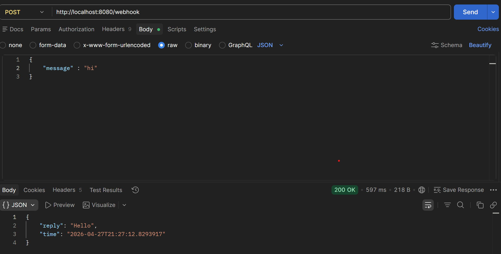
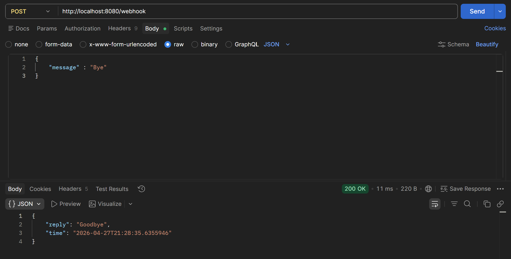
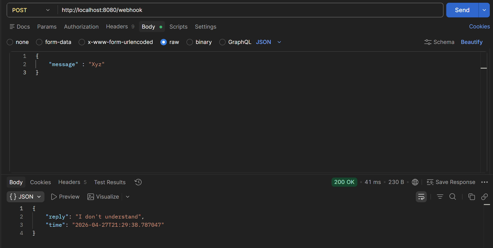
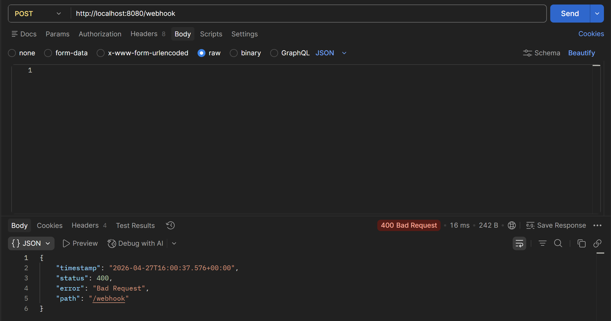

# WhatsApp Chatbot Backend Simulation

A Spring Boot REST API that simulates a WhatsApp chatbot backend — built as part of the **Jarurat Care Java Developer Internship Assignment**.

**Live URL:** https://jaruratcare-chatbot-w9k2.onrender.com/webhook

---

## Project Overview

This project implements a simple WhatsApp chatbot backend simulation using **Java** and **Spring Boot**. It exposes a `/webhook` POST endpoint that accepts JSON-formatted messages and returns predefined intelligent replies — mimicking how a real WhatsApp chatbot would receive and respond to messages via Meta Webhooks.

---

## Tech Stack

| Technology    | Purpose                          |
|---------------|----------------------------------|
| Java 17+      | Core programming language        |
| Spring Boot 3 | Framework for building REST APIs |
| Spring Web    | REST endpoint handling           |
| Lombok        | Boilerplate reduction (DTOs)     |
| SLF4J / Logback | Logging incoming messages      |
| Maven         | Dependency management            |
| Postman       | API testing                      |

---

## 📁 Project Structure

```
whatsapp-chatbot/
├── src/
│   └── main/
│       └── java/
│           └── com/jarurat/chatbot/
│               ├── controller/
│               │   └── ChatController.java
│               ├── service/
│               │   └── ChatService.java
│               └── dto/
│                   ├── ChatRequest.java
│                   └── ChatResponse.java
├── pom.xml
└── README.md
```

---

## Setup & Running Locally

### Prerequisites

- Java 17 or higher installed
- Maven installed
- Git installed

### Steps

```bash
# 1. Clone the repository
git clone https://github.com/sadabazhar/jaruratcare.chatbot.git
cd whatsapp-chatbot

# 2. Build the project
mvn clean install

# 3. Run the application
mvn spring-boot:run
```

The server will start at: `http://localhost:8080`

---

## API Reference

### POST `/webhook`

Receives a simulated WhatsApp message and returns a chatbot reply.

| Environment | Base URL |
|-------------|----------|
| Local       | `http://localhost:8080/webhook` |
| Production  | `https://jaruratcare-chatbot-w9k2.onrender.com/webhook` |

**Request Headers:**
```
Content-Type: application/json
```

**Request Body:**
```json
{
  "message": "hi"
}
```

**Response Body:**
```json
{
  "reply": "Hello",
  "time": "2026-04-27T15:44:40.636"
}
```

### Response Logic

| Input Message (case-insensitive) | Bot Reply                 |
|----------------------------------|---------------------------|
| `hi`                             | `Hello`                   |
| `bye`                            | `Goodbye`                 |
| *(empty / blank)*                | `Message cannot be empty` |
| *(anything else)*                | `I don't understand`      |

---

## Postman Testing

### Test 1 — `hi` → `Hello`

**Request:**
```
POST https://jaruratcare-chatbot-w9k2.onrender.com/webhook
Content-Type: application/json

{
    "message": "hi"
}
```

**Response:**
```json
{
  "reply": "Hello",
  "time": "2026-04-27T15:44:40.6364555"
}
```

📸 **Screenshot:**

> 
>
> *POST request with `"hi"` returns `"Hello"` with a 200 OK status.*

---

### Test 2 — `bye` → `Goodbye`

**Request:**
```
POST https://jaruratcare-chatbot-w9k2.onrender.com/webhook
Content-Type: application/json

{
    "message": "bye"
}
```

**Response:**
```json
{
  "reply": "Goodbye",
  "time": "2026-04-27T15:54:14.6557847"
}
```

📸 **Screenshot:**

> 
>
> *POST request with `"bye"` returns `"Goodbye"` with a 200 OK status.*

---

### Test 3 — Unknown message → `I don't understand`

**Request:**
```
POST https://jaruratcare-chatbot-w9k2.onrender.com/webhook
Content-Type: application/json

{
    "message": "xyz"
}
```

**Response:**
```json
{
  "reply": "I don't understand",
  "time": "2026-04-27T15:54:33.8556196"
}
```

📸 **Screenshot:**

> 
>
> *POST request with an unknown message returns the default fallback reply.*

---

### Test 4 — empty message → `Bad Request Exception`

**Request:**
```
POST https://jaruratcare-chatbot-w9k2.onrender.com/webhook
Content-Type: application/json

{

}
```

**Response:**
```json
{
  "timestamp": "2026-04-27T16:00:37.576+00:00",
  "status": 400,
  "error": "Bad Request",
  "path": "/webhook"
}
```

📸 **Screenshot:**

> 
>
> *POST request with an empty message throws a Bad Request Exception.*

---

## Code Walkthrough

### `ChatRequest.java` — Incoming DTO

```java
@Data
public class ChatRequest {
    @NotBlank
    private String message;
}
```

Validates that the incoming `message` field is not blank before the request reaches the controller.

---

### `ChatResponse.java` — Outgoing DTO

```java
@Data
@Builder
public class ChatResponse {
    private String reply;
    private LocalDateTime time;
}
```

Uses the Builder pattern for clean, readable response construction.

---

### `ChatService.java` — Business Logic

```java
@Service
public class ChatService {

    public ChatResponse getReply(String message) {

        if (message == null || message.trim().isEmpty()) {
            return ChatResponse.builder()
                    .reply("Message cannot be empty")
                    .time(LocalDateTime.now())
                    .build();
        }

        return switch (message.toLowerCase()) {
            case "hi"  -> ChatResponse.builder().reply("Hello").time(LocalDateTime.now()).build();
            case "bye" -> ChatResponse.builder().reply("Goodbye").time(LocalDateTime.now()).build();
            default    -> ChatResponse.builder().reply("I don't understand").time(LocalDateTime.now()).build();
        };
    }
}
```

- Handles null/empty edge cases defensively
- Uses Java's modern `switch` expression for clean pattern matching
- `.toLowerCase()` makes the matching case-insensitive

---

### `ChatController.java` — REST Endpoint

```java
@RestController
@RequestMapping("/webhook")
@RequiredArgsConstructor
public class ChatController {

    private final ChatService chatService;
    private static final Logger logger = LoggerFactory.getLogger(ChatController.class);

    @PostMapping
    public ResponseEntity<ChatResponse> handleMessage(@Valid @RequestBody ChatRequest request) {

        logger.info("Incoming message received at {}: {}", LocalDateTime.now(), request.getMessage());

        ChatResponse reply = chatService.getReply(request.getMessage());

        logger.info("Reply sent: {}", reply.getReply());

        return ResponseEntity.ok(reply);
    }
}
```

- `@Valid` ensures the request DTO is validated before processing
- SLF4J logger records both incoming messages and outgoing replies for observability
- Returns `200 OK` with the response wrapped in `ResponseEntity`

---

## Logging

Every incoming request and outgoing reply is logged to the console. Sample log output:

```
INFO  ChatController - Incoming message received at 2026-04-27T15:44:40: hi
INFO  ChatController - Reply sent: Hello
```

This simulates the message logging requirement of a real WhatsApp chatbot backend.

---

## Deployment

This application is deployed on [Render](https://render.com).

**Live endpoint:** `https://jaruratcare-chatbot-w9k2.onrender.com/webhook`

### Try it now with curl:
```bash
curl -X POST https://jaruratcare-chatbot-w9k2.onrender.com/webhook \
  -H "Content-Type: application/json" \
  -d '{"message": "hi"}'
```

---

## Assignment Checklist

- [x] REST API endpoint `/webhook` accepting POST requests
- [x] JSON input simulating WhatsApp messages
- [x] Predefined replies: `hi → Hello`, `bye → Goodbye`
- [x] All incoming messages are logged
- [x] Tested locally with Postman (screenshots included)
- [x] Edge case handling (null/empty/unknown messages)
- [x] Deployed on Render

---

## Author

**Sadab Azhar**  
Java Developer Intern Applicant  
Jarurat Care Internship Assignment  
Submitted: April 28, 2026

---

## 📄 License

This project is built for internship assignment purposes only.